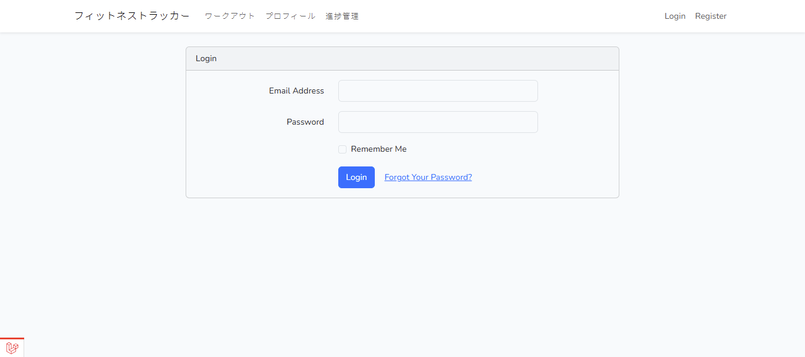
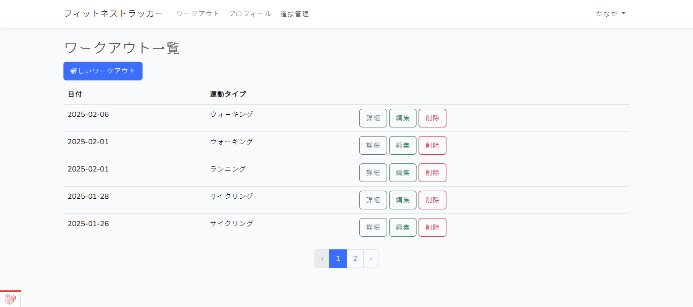
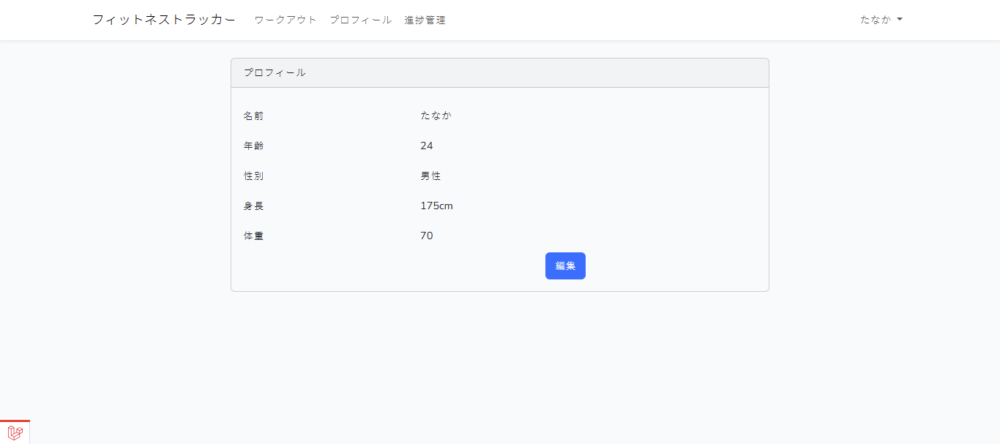
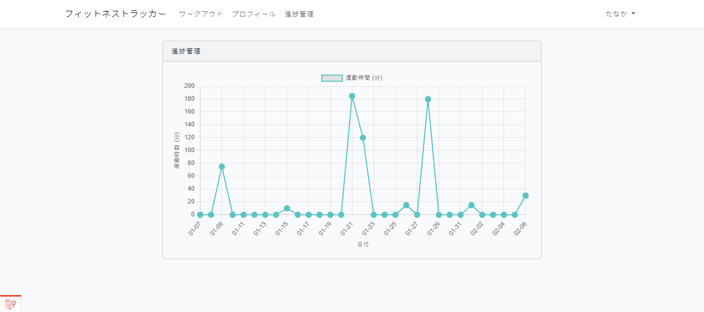

# FitnessTracker

## FitnessTracker
`FitnessTracker` は Laravel を使用したフィットネス管理システムです。  
ワークアウトの記録の機能を備えたシンプルなウェブアプリケーションです。

---

## 機能一覧
- **ユーザー管理**（ログイン・登録・認証）
- **ワークアウト管理**（トレーニングの記録・編集・削除）
- **ダッシュボード**（統計情報の可視化）

---

## 使用技術
- **バックエンド**: Laravel 11
- **データベース**: MySQL
- **フロントエンド**: Blade, Bootstrap
- **認証**: Laravel Auth
- **環境変数管理**: `.env`

---

## スクリーンショット

### ログインページ
ユーザーが認証情報を入力してシステムにログインする画面です。

### ワークアウト記録画面
トレーニングのデータを記録・管理する画面です。

### プロフィール画面
ユーザーのプロフィール画面です。

### 統計画面
過去1か月の運動データを可視化したダッシュボードです。

